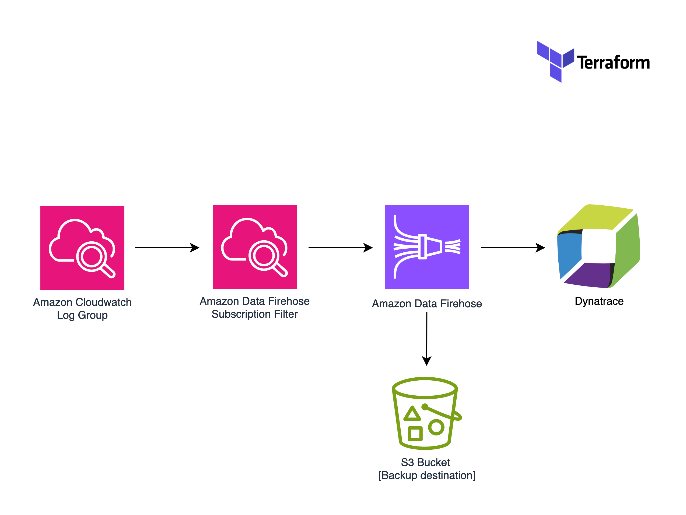

# AWS Cloudwatch Logs to Dynatrace

This sample demonstrates how to send AWS CloudFront logs to Dynatrace.

- Dynatrace API URL is placed in the `dynatrace_url` variable
- Dynatrace token is placed in a AWS Secret Manager secret (secret key: api_key, secret value: your token)
  more information
  [here](https://docs.dynatrace.com/docs/shortlink/lma-stream-logs-with-firehose#prerequisites)
- KMS encryption is optional

## Architecture diagram

<!-- BEGIN_TF_DOCS -->

### Requirements

| Name | Version |
|------|---------|
|  [terraform](#requirement\_terraform) | >= 1.6.2 |
|  [aws](#requirement\_aws) | >=5.59.0 |

### Inputs

| Name | Description | Type | Default | Required |
|------|-------------|------|---------|:--------:|
|  [app\_env](#input\_app\_env) | Environment name of the application. | `string` | `"test"` | no |
|  [app\_name](#input\_app\_name) | Name of the application. | `string` | `"demoapp"` | no |
|  [app\_owner](#input\_app\_owner) | Owner of the application. | `string` | `"me"` | no |
|  [custom\_tags](#input\_custom\_tags) | A map of tags to add to all resources. | `map(string)` | `{}` | no |
|  [dynatrace\_url](#input\_dynatrace\_url) | URL of the Dynatrace endpoint. | `string` | `"https://*****.live.dynatrace.com"` | no |

<!-- END_TF_DOCS -->
<!-- BEGINNING OF PRE-COMMIT-TERRAFORM DOCS HOOK -->
README.md updated successfully
<!-- END OF PRE-COMMIT-TERRAFORM DOCS HOOK -->
